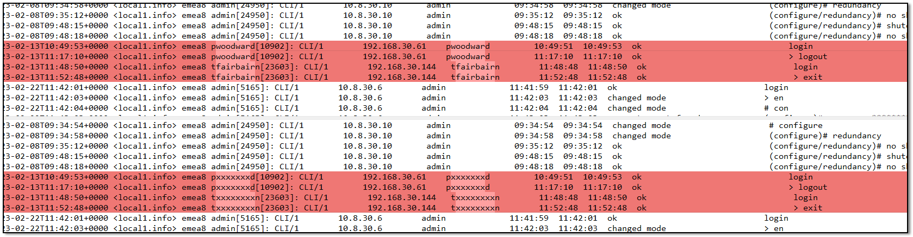

# scrub-gather-diagnostics

This was written for a customer that had a regulatory requirement to hide specific usernames from any diagnostic files that were sent to vendors.  Solace Support always ask for a "[Gather Diagnostics](https://docs.solace.com/Appliance/Gathering-Appliance-Diagnostics.htm)" file from any broker involved in an issue.  This "GD" tarball contains a multitude of logs and diagnostic files from the broker, and is essential for the Support team to perform their diagnoses.




## Usage

Perform the gather diagnostics action as usual, but ensure the "**no-encrypt**" options is chosen:
```
solace1025> enable
solace1025# admin
solace1025(admin)# gather-diagnostics days-of-history 14 no-encrypt

Starting to copy files...
Finished copying files...

Starting to run diagnostic commands...
<SNIP>
Finished running diagnostic commands...

Creating encrypted tarball...
Finished creating encrypted tarball...

Diagnostics saved in: logs/gather-diagnostics_1d_solace1025_2026-03-06T00.00.18.tgz

solace1025(admin)#
```

Copy the generated file to your Linux box, or Mac, or WSL on Windows where this script resides.  (if you really don't have a Linux box, all the required utilities are installed on the Solace control plane... you could copy the script onto the broker, placing it in `/usr/sw/jail/logs` and run from there).

### User File

By default, the script loads in the text file `known_users.txt`, and searches all the files within the gather diagnostics tarball for those names and obfuscates them.  Please build your own list from LDAP or Active Directory or wherever.  Feel free to edit the name of the user file at the top of the script.

In my testing while building the script, it worked fine for 5000 usernames, although a bit slower.  If you have more usernames than that, or the script is breaking, please raise a GH Issue: there are some known improvements that could be made in this area.


### Running

Run by passing the name of the gather diagnostics tarball to the script.  At the end, you'll have an option to encrypt the scrubbed version using `gpg`.

```
$ ./gd-scrub.sh gather-diagnostics_14d_solace1025_2026-02-22T23.21.18.tgz

 ┌──────────────────────────────────────────────────╖
 │ Solace gather-diagnostics username scrubber v1.0 ║
 │       - Aaron Lee | ©2026 | aaron.lee@solace.com ║
 ╘══════════════════════════════════════════════════╝

Loading 'known_users.txt' list of usernames to search for...
4 usernames loaded.
Extracting 'gather-diagnostics_14d_solace1025_2026-02-22T23.21.18.tgz'...
Unzipping any compressed files inside...
168 files found... stand by.
 ├─ var/log/solace/secure
 ├─ var/lib/solace/config/rsyslog.d/02_solace.conf
 ├─ var/lib/solace/config/rsyslog.d/01_confd.conf
 ├─ var/lib/solace/config/sol-platform-audit.json
 ├─ var/lib/solace/diags/confd.log
 ├─ cli-diagnostics.txt
 ├─ log.txt
 ├─ manifest.txt
 ├─ linux-diagnostics.txt
 ├─ usr/sw/var/soltr_10.25.10.3402/.dbHistory/db.0000004e/dbJournal
 ├─ usr/sw/var/soltr_10.25.10.3402/.dbHistory/db.0000004e/dbBaseline
 ├─ usr/sw/var/soltr_10.25.10.3402/.dbHistory/db.0000004e/dbJournal.1
<SNIP>
 ├─ usr/sw/jail/diags/ad.debug.adHistogram_Spooling.371,10,2026-02-18,15.14.49
 ├─ usr/sw/jail/diags/ad.debug.adHistogram_SA:JournalMateWrite.371,3,2026-02-18,15.14.49
 ├─ usr/sw/.soltop.dat
 ├─ usr/sw/loads/currentload/webclient.md5sum
Scrubbing complete!
Re-tarring diagnostics...
Would you like to encrypt the output file with GPG? (y/n): y
Saved encrypted file. *REMEMBER YOUR PASSWORD* and pass to Solace Support for extract.
Cleaning up...
Use: "gpg -o scrubbed-gather-diagnostics_14d_solace1025_2026-02-22T23.21.18.tgz -d scrubbed-gather-diagnostics_14d_solace1025_2026-02-22T23.21.18.tgz.gpg" to extract.
Done!
```


